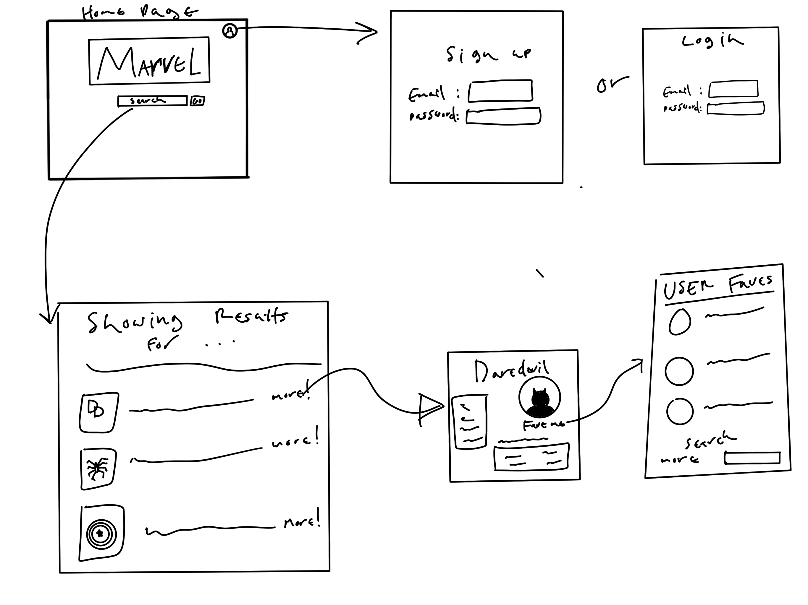

# VIRTUAL MARVEL ENCYCLOPEDIA

Have you ever been reading a Marvel comic or watching a Marvel movie and didn't know who a certain character was? No worries! With the Virtual Marvel Encyclopedia, you can simply search and find all you could want to know about thousands of Marvel characters! 

### API
Marvel API 
https://developer.marvel.com/

### MVP

1. Home Page
    1. Search Bar(To search Heroes or villains)
    2. Login Button
    3. Collage of comics changing in background
2. Sign Up Page
    1. Email
    2. Password
3. User account Page
    1. List of favorite heroes/villains
        1. Summary of hero
        2. Photo of hero
        3. Link to hero page
4. Hero/Villain List of search Results Page
    1. List of all search results
        1. Link to results full page
        2. summary of result
        3. Photo of result
5. Hero/Villain Summary Page
    1. Hero Photo
    2. Summary of hero
    4. Reccommended comics


### User Stories
I want to look up any Marvel Character

I want to create an account

I want to look up a Marvel Character and see a list of all characters and then select the one I want

I want to get comic reccomendations for each character

I want to save all of my favorite Heroes or Villains to my account

### Installation Instructions
- Fork and clone the code repo and run `npm i` 
  <details>
    <summary> NPM dependencies that will download </summary>

    -"axios": "^0.26.0",
    -"bcrypt": "^5.0.1",
    -"bootstrap": "^5.1.3",
    -"cookie-parser": "^1.4.6",
    -"crypto-js": "^4.1.1",
    -"dotenv": "^16.0.0",
    -"ejs": "^3.1.6",
    -"express": "^4.17.3",
    -"express-ejs-layouts": "^2.5.1",
    -"method-override": "^3.0.0",
    -"pg": "^8.7.3",
    -"sequelize": "^6.17.0",
    -"sequelize-cli": "^6.4.1"

  </details>

- Run `create database marvel_characters` (`createdb marvel_characters` on non WSL)
- Run `sequelize db:migrate` to create the tables
- Go to "https://developer.marvel.com/" to sign up and request API keys
- You will receive a Public and a Private API key. Both are needed.
- Create a `.env` file and copy the keys into the file.
- The file should look like:
```
SECRET=somethingsupersecret(this value can be whatever you would like)
PUBLIC_API_KEY=(Your public API Key goes here)
PRIVATE_API_KEY=(Your private API Key goes here)
PORT=(select whatever port you would like to work off, 8000 is typically open)
```

### link to deployed site

https://virtual-marvel-encyclopedia.herokuapp.com/

### Approach

### Code Highlights


### wireframe


### Stretch Goals
1. Custom art for a few select heroes
2. Searching Animation

### Restful routing

| **URL** | **HTTP Verb** |
|------------|-------------|
|/         | GET   
|/search    | GET
|/details/:id   | GET 
|/faves       | POST
|/favorites       | GET
| /users/new         | GET         
| /users/login          | GET  
| /users/login          | POST 
| /users/logout          | POST 
| /users         | POST 
| /delete          | DELETE 
| /updateName          | POST
| /comments         | POST


### Sources

Marvel API - https://developer.marvel.com/
Bootstrap - https://getbootstrap.com/docs/5.1/getting-started/introduction/

### Post-project reflections

1. Better research and investigate APIs before use. Marvel API isnt up to date and is missing a lot of info I had intended to include in the site. 
2. Lay out style guidelines before creation. Fonts, colors, and general appearance was hard to make feel natural once site had already taken form. 

#### Overall post-project thoughts


## ERDs 

