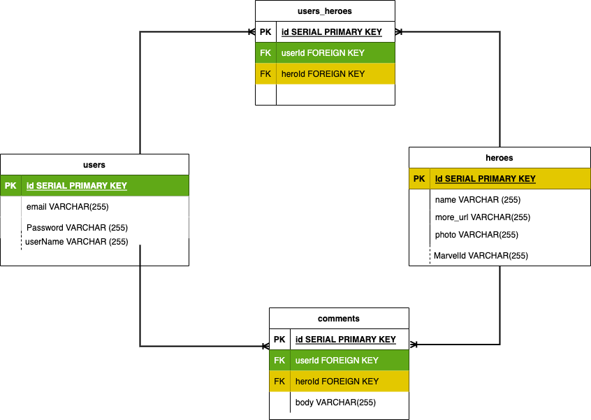

# VIRTUAL MARVEL ENCYCLOPEDIA

Have you ever been reading a Marvel comic or watching a Marvel movie and didn't know who a certain character was? No worries! With the Virtual Marvel Encyclopedia, you can simply search and find all you could want to know about thousands of Marvel characters! 

### API
Marvel API 
https://developer.marvel.com/

### MVP

1. Home Page
    1. Search Bar(To search Heroes or villains)
    2. Login Button
    3. Collage of comics changing in background
2. Sign Up Page
    1. Email
    2. Password
3. User account Page
    1. List of favorite heroes/villains
        1. Summary of hero
        2. Photo of hero
        3. Link to hero page
4. Hero/Villain List of search Results Page
    1. List of all search results
        1. Link to results full page
        2. summary of result
        3. Photo of result
5. Hero/Villain Summary Page
    1. Hero Photos (self rotating or click through)
    2. Summary of hero
    3. Creator of Hero
    4. Reccommended comics
    5. Hero Stats
    6. Hero relationships

### User Stories
I want to look up any Marvel Character

I want to create an account

I want to look up a Marvel Character and see a list of all characters and then select the one I want

I want to get comic reccomendations for each character

I want to save all of my favorite Heroes or Villains to my account

### Installation Instructions

### link to deployed site

### Approach

### wireframe

### Stretch Goals
1. Custom art for a few select heroes
2. Searching Animation

### Restful routing

### Sources

Marvel API - https://developer.marvel.com/

### Post-project reflections

## ERDs 

